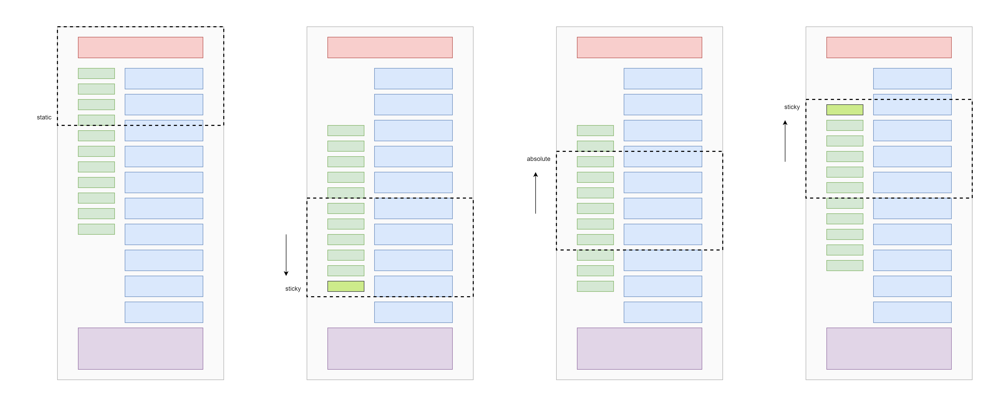

# overflowing-sticky

Solution for sticky elements that are taller than the viewport.

## Problem

Making an element sticky works nice as long as the element height is lower than the viewport height.

If one were to make an element with height that is greater than the viewport height sticky, problems arise. Bottom of the element won't be visible in the viewport. One needs to scroll down to see the overflowing content, but since the element is sticky, the top side of the element will stick to the viewport, and the user won't be able to see the bottom/overflowing part of the element. To see the bottom part, one would have to scroll down to the end of the page so that the sticky effect ends and the bottom part is now in the viewport.

## Solution

Instead of making an element only stick to the top side of the viewport, we can toggle between two states of sticky: top and bottom.

When scrolling down, sticky effect doesn't start until the bottom of the element is in (at the bottom) the viewport. Then the expected sticky effect kicks in. After scrolling down, if we scroll up, sticky effect should stop and switch to absolute, so we can scroll the element. Again, once the top side of the element is in (at the top) the viewport, sticky kicks in. Each time the sticky effect kicks in, we simply "stick" a different side (top or bottom) of the element.

In other words, we scroll a little to see the overflowing part of the sticky element. So we need to change the position/direction of the overflowing part and place it opposite to the scroll direction.

## Implementation

WIP

## Why?

I decided to tackle this problem, because I was (and still) annoyed with the [Laravel Docs](https://laravel.com/docs). There are some pages with really long content, and having to scroll up to the top of the page to see the TOC at the left side is tedious. I was curious as to why the TOC is not sticky, but realized that the element is taller than the viewport. So making it sticky isn't practical. With a solution like mentioned above, it won't be a problem anymore.
